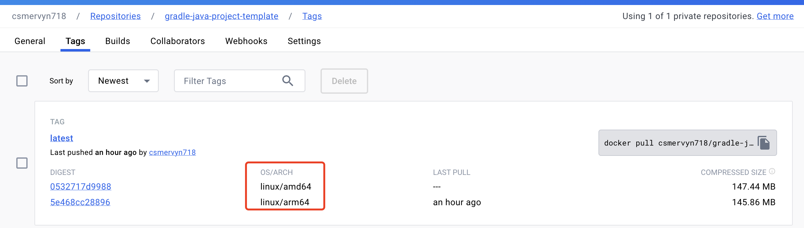

# Build multiple platforms and architecture image
Docker buildx is a plugin. It extends the building ability of images by using the BuildKit builder. Hence, with the plugin, we can build images for different platforms and architectures.
## Prerequisites
- Colima
- MAC os
## Install buildx
It didn't install the buildx docker plugin by default if we use colima. You get following error if you check the buildx version.
1. Check the buildx version
```shell
docker buildx version
```
The error we got.
```text
docker: 'buildx' is not a docker command.
See 'docker --help'
```
2. That means we need install buildx, and we can use brew to install buildx if you use MAC OS.
```shell
brew install docker-buildx
``
output:
```text
==> Fetching docker-buildx
==> Downloading https://ghcr.io/v2/homebrew/core/docker-buildx/blobs/sha256:316f90184d51579d9e80a5a38a3d93c176c8d55375215c4831a7a99db978eaa4
#################################################################################################################################################################### 100.0%
==> Pouring docker-buildx--0.12.0.arm64_sonoma.bottle.tar.gz
==> Caveats
docker-buildx is a Docker plugin. For Docker to find this plugin, symlink it:
  mkdir -p ~/.docker/cli-plugins
  ln -sfn /opt/homebrew/opt/docker-buildx/bin/docker-buildx ~/.docker/cli-plugins/docker-buildx

zsh completions have been installed to:
  /opt/homebrew/share/zsh/site-functions
==> Summary
🍺  /opt/homebrew/Cellar/docker-buildx/0.12.0: 26 files, 57.1MB
==> Running `brew cleanup docker-buildx`...
Disable this behaviour by setting HOMEBREW_NO_INSTALL_CLEANUP.
Hide these hints with HOMEBREW_NO_ENV_HINTS (see `man brew`).
```
**Notice: We need to follow the caveats mentioned in the install instructions:**
```shell
mkdir -p ~/.docker/cli-plugins
ln -sfn /opt/homebrew/opt/docker-buildx/bin/docker-buildx ~/.docker/cli-plugins/docker-buildx
```
3. Check the buildx version again
```shell
docker buildx version
```
output:
```text
github.com/docker/buildx v0.12.0 542e5d810e4a1a155684f5f3c5bd7e797632a12f
```
That output means we finish the installment of buildx.
## Building with buildx
1. Prepare your Dockerfile
2. Check the buildx builder
```shell
docker buildx ls
```
output:
```shell
NAME/NODE    DRIVER/ENDPOINT  STATUS  BUILDKIT             PLATFORMS
colima *     docker
  colima     colima           running v0.11.7+d3e6c1360f6e linux/arm64, linux/amd64, linux/amd64/v2
default                       error
```
We can see the current builder we use is `colima`, and that builder support linux/arm64 and linux/amd64. We can use this builder directly.
- If your current builder not support multiple platforms we can use following command to switch buildx builder.
```shell
docker buildx use {your-builder-name}
```
- If all the builder doesn't supports the platforms we want, you can use following command to create new one.
```shell
buildx create  --name mybuilder
```
That command will create the builder named mybuilder, and then you need switch to this builder and bootstrap it.
3. Build images and push
You can directyl follow the `Final try` section.
- My first try(failed)
```shell
docker buildx build  -t csmervyn718/gradle-java-project-template:latest --platform=linux/arm64,linux/amd64 .
```
output:
```text
 => [internal] load build definition from Dockerfile                                                                                                             0.0s
 => => transferring dockerfile: 208B                                                                                                                             0.0s
 => [linux/arm64 internal] load metadata for docker.io/library/amazoncorretto:17-alpine3.18-jdk                                                                  4.4s
 => [linux/amd64 internal] load metadata for docker.io/library/amazoncorretto:17-alpine3.18-jdk                                                                  4.3s
 => [internal] load .dockerignore                                                                                                                                0.0s
 => => transferring context: 2B                                                                                                                                  0.0s
 => [internal] load build context                                                                                                                                0.2s
 => => transferring context: 6.22MB                                                                                                                              0.2s
 => [linux/arm64 1/3] FROM docker.io/library/amazoncorretto:17-alpine3.18-jdk@sha256:97077b491447b095b0fe8d6d6863526dec637b3e6f8f34e50787690b529253f3          303.5s
 => => resolve docker.io/library/amazoncorretto:17-alpine3.18-jdk@sha256:97077b491447b095b0fe8d6d6863526dec637b3e6f8f34e50787690b529253f3                        0.0s
 => => sha256:c7959a0748edc5c4e60be561f317589456f47dd903864e189ba8059bff388bdf 144.01MB / 144.01MB                                                             301.9s
 => => sha256:2c03dbb20264f09924f9eab176da44e5421e74a78b09531d3c63448a7baa7c59 3.33MB / 3.33MB                                                                   7.2s
 => => extracting sha256:2c03dbb20264f09924f9eab176da44e5421e74a78b09531d3c63448a7baa7c59                                                                        0.1s
 => => extracting sha256:c7959a0748edc5c4e60be561f317589456f47dd903864e189ba8059bff388bdf                                                                        1.5s
 => [linux/amd64 1/3] FROM docker.io/library/amazoncorretto:17-alpine3.18-jdk@sha256:97077b491447b095b0fe8d6d6863526dec637b3e6f8f34e50787690b529253f3          288.7s
 => => resolve docker.io/library/amazoncorretto:17-alpine3.18-jdk@sha256:97077b491447b095b0fe8d6d6863526dec637b3e6f8f34e50787690b529253f3                        0.0s
 => => sha256:0f42aa8d40546dacc68be3d96c6b5135910e9115763e6e6ef64bbe114e95fd16 145.60MB / 145.60MB                                                             286.9s
 => => sha256:c926b61bad3b94ae7351bafd0c184c159ebf0643b085f7ef1d47ecdc7316833c 3.40MB / 3.40MB                                                                   9.3s
 => => extracting sha256:c926b61bad3b94ae7351bafd0c184c159ebf0643b085f7ef1d47ecdc7316833c                                                                        0.1s
 => => extracting sha256:0f42aa8d40546dacc68be3d96c6b5135910e9115763e6e6ef64bbe114e95fd16                                                                        1.7s
 => [linux/amd64 2/3] WORKDIR /app                                                                                                                               0.3s
 => [linux/amd64 3/3] COPY app/build/libs/app-all.jar .                                                                                                          0.0s
 => [linux/arm64 2/3] WORKDIR /app                                                                                                                               0.2s
 => [linux/arm64 3/3] COPY app/build/libs/app-all.jar .                                                                                                          0.0s
WARNING: No output specified with docker-container driver. Build result will only remain in the build cache. To push result image into registry use --push or to load image into docker use --load
```
**If you try to build image in this way you will get a WARNING. That WARNING tell us the image in the cache and we need load it into docker or push it to docker hub.**
- My second try(failed)
```shell
docker buildx build --load -t csmervyn718/gradle-java-project-template:latest --platform=linux/arm64,linux/amd64 .
```
output:
```shell
ERROR: docker exporter does not currently support exporting manifest lists
```
**The reason is we put one more argument for platform(`linux/arm64,linux/amd64`). We can just pass one value to above command and build it one by one or we use `--push` parameter and push these images to docker hub. We opt for the latter choice here.** 
- Final try(successes)
```shell
docker login
```
```shell
docker buildx build  -t csmervyn718/gradle-java-project-template:latest --platform=linux/arm64,linux/amd64 . --push
```
output:
```text
 => [internal] load build definition from Dockerfile                                                                                                                  0.0s
 => => transferring dockerfile: 208B                                                                                                                                  0.0s
 => [linux/arm64 internal] load metadata for docker.io/library/amazoncorretto:17-alpine3.18-jdk                                                                       2.8s
 => [linux/amd64 internal] load metadata for docker.io/library/amazoncorretto:17-alpine3.18-jdk                                                                       2.6s
 => [auth] library/amazoncorretto:pull token for registry-1.docker.io                                                                                                 0.0s
 => [internal] load .dockerignore                                                                                                                                     0.0s
 => => transferring context: 2B                                                                                                                                       0.0s
 => [linux/arm64 1/3] FROM docker.io/library/amazoncorretto:17-alpine3.18-jdk@sha256:97077b491447b095b0fe8d6d6863526dec637b3e6f8f34e50787690b529253f3                 0.0s
 => => resolve docker.io/library/amazoncorretto:17-alpine3.18-jdk@sha256:97077b491447b095b0fe8d6d6863526dec637b3e6f8f34e50787690b529253f3                             0.0s
 => [linux/amd64 1/3] FROM docker.io/library/amazoncorretto:17-alpine3.18-jdk@sha256:97077b491447b095b0fe8d6d6863526dec637b3e6f8f34e50787690b529253f3                 0.0s
 => => resolve docker.io/library/amazoncorretto:17-alpine3.18-jdk@sha256:97077b491447b095b0fe8d6d6863526dec637b3e6f8f34e50787690b529253f3                             0.0s
 => [internal] load build context                                                                                                                                     0.0s
 => => transferring context: 136B                                                                                                                                     0.0s
 => CACHED [linux/arm64 2/3] WORKDIR /app                                                                                                                             0.0s
 => CACHED [linux/arm64 3/3] COPY app/build/libs/app-all.jar .                                                                                                        0.0s
 => CACHED [linux/amd64 2/3] WORKDIR /app                                                                                                                             0.0s
 => CACHED [linux/amd64 3/3] COPY app/build/libs/app-all.jar .                                                                                                        0.0s
 => exporting to image                                                                                                                                              377.4s
 => => exporting layers                                                                                                                                               0.2s
 => => exporting manifest sha256:5e468cc288964a97f41811e2826da3a2516804f8691bbbba47179b941bc7bc30                                                                     0.0s
 => => exporting config sha256:cdec26a8945f8f28bc9926bc3bbdc0c0523dd0dd5b8740b5adbd2490aa99a551                                                                       0.0s
 => => exporting attestation manifest sha256:b810c8a3fd704c9d5ba8f4884ce3d9573cfb8c0e8b0adc927af3bf52a163896a                                                         0.0s
 => => exporting manifest sha256:0532717d998817e85daed42ccb5488fe4393342c1375f4c1aa38fa5b2d4617dc                                                                     0.0s
 => => exporting config sha256:b4f6f62ed4551391f6641e32c394c67c3928779adff5a48c665416b887bdb33e                                                                       0.0s
 => => exporting attestation manifest sha256:d23aa46a24b0ebf3c920dbbe0997cc92ecf2700f01c53495f60bd56238be0209                                                         0.0s
 => => exporting manifest list sha256:61d0ee6cf7c433712ea919e73f8ffa95f32e6b06bd207a8dd785f7be3174ef66                                                                0.0s
 => => pushing layers                                                                                                                                               371.5s
 => => pushing manifest for docker.io/csmervyn718/gradle-java-project-template:latest@sha256:61d0ee6cf7c433712ea919e73f8ffa95f32e6b06bd207a8dd785f7be3174ef66         5.6s
 => [auth] csmervyn718/gradle-java-project-template:pull,push token for registry-1.docker.io                                                                          0.0s
 => [auth] csmervyn718/gradle-java-project-template:pull,push token for registry-1.docker.io
```
When above finished, we can check these images in docker hub.

## Verify the image
1. pull image
```shell
docker pull csmervyn718/gradle-java-project-template:latest
```
2. Run
```shell
docker run csmervyn718/gradle-java-project-template
```
output:
```text
23:05:38.853 [main] INFO com.mervyn.learn.gradle.App -- Hello World!
```
If you see that log, that means our image build success and works well.
